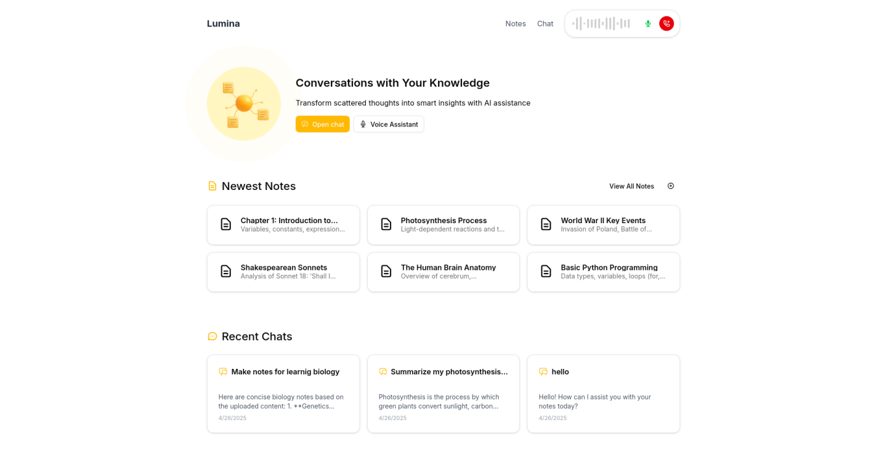

# Lumina

Lumina is an AI-powered learning companion that transforms scattered thoughts into organized knowledge. Built for the OpenAI Hackathon, this application combines advanced AI agents with a modern web interface to create an intelligent system that understands, organizes, and enhances your learning experience.

## ✨ Features

### 🤖 Intelligent AI Agents

- **Main Assistant Agent**: Orchestrates all other agents to provide contextually relevant responses
- **Quiz Generation**: Creates custom quizzes with both open-ended and multiple-choice questions
- **Question & Answer**: Advanced Q&A capability with context from your notes
- **Summary Agent**: Generates concise summaries of your notes and conversations
- **Review Agent**: Provides detailed reviews of content with references to your knowledge base

### 📝 Smart Note Management

- **Vector-Based Storage**: Semantically organizes notes for intelligent retrieval
- **Markdown Support**: Rich text formatting for comprehensive note-taking
- **Knowledge Base**: Build a personal knowledge graph that grows with you

### 💬 Multimodal Interaction

- **Text Chat**: Natural language conversations with your knowledge base
- **Voice Interface**: Speak to your assistant and receive voice responses
- **Streaming Responses**: Real-time, token-by-token AI responses for a fluid experience

### 🎨 Interactive Canvas

- **Visual Thinking**: Create and manipulate visual representations of your knowledge

## 🛠️ Technology Stack

### Frontend

- **Next.js**: React framework with server-side rendering
- **TypeScript**: Type-safe JavaScript for robust development
- **Tailwind CSS**: Utility-first CSS framework for responsive design
- **Shadcn UI**: Component library for a consistent design system

### Backend

- **FastAPI**: High-performance Python web framework
- **OpenAI API**: Powers the intelligent AI agents
- **Vector Database**: For semantic search and retrieval of notes
- **MongoDB**: Document database for storing notes and conversations

